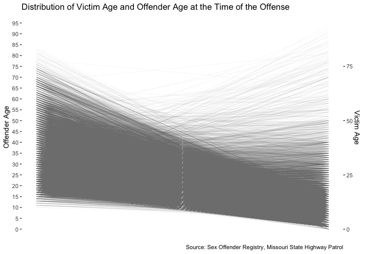

```{r setup, include=FALSE}
knitr::opts_chunk$set(echo = TRUE)
```

# Overview

When I looked up sex offender statistics, I found that women are faced with threats from a large number of sex offenders starting at a young age. Some of the offenders re-offended. 

Missouri maintains a database as part of its Sex Offender Registration program, required by the Wetterling Crimes Against Children and Sexually Violent Offender Registration Act since 1995.

[Missouri State Highway Patrol's website](http://www.mshp.dps.missouri.gov/MSHPWeb/PatrolDivisions/CRID/SOR/SORPage.html) publishes the database along with photos of the offenders to facilitate the public knowledge of the offenders. Notably, only those who were convicted or offered a plea were registered.

In compliance with Title I of the Adam Walsh Child Protection and Safety Act of 2006, entitled the Sex Offender Registration and Notification Act (SORNA), all 50 states have such a database to keep track of sex offenders. The [FBI Sex Offender Registry Website](https://www.fbi.gov/scams-and-safety/sex-offender-registry) is a gateway to sex offender registries in all 50 states.

## Loading Data Packages
```{r loading packages, message=F}
library(dplyr)
library(ggplot2)
library(readxl)
library(stringr)
library(tidycensus)
library(scales)
library(viridis)
```

```{r set up environment}
#If on a Mac, uncomment the following two lines when knitting.
# options(device = "X11") 
# X11.options(type = "cairo")
```

## Read the data table
The downloadable datasets from the Registry include multiple items. According to the [fact sheet](http://www.mshp.dps.missouri.gov/MSHPWeb/PatrolDivisions/CRID/SOR/factsheet.html),name, alias names, date of birth, alias dates of birth, physical description, all addresses, offense, vehicle information, pictures of registered sex offenders and offense dates were available on the website. We used the two datasets *`msor.xlsx`*, which is a database of offenders, as well as *`msir_offense`*, which includes more details about individual sex offense cases.

```{r pressure, echo=T}
MO_offense <- read_xlsx("msor/msor_offense.xlsx", skip = 13) 
colnames(MO_offense) <- make.names(colnames(MO_offense))
MO_offense <- rename(MO_offense, Off.Age= Offender.Age.at.Time.of.Offense) 
MO_offense$Off.Age <- as.numeric(MO_offense$Off.Age)
MO_offense$Victim.Age <- as.numeric(MO_offense$Victim.Age)
```

#Plotting Offender Age and Victim Age
```{r}
#Drawing the plot with the geom_line function in ggplot2
p <- ggplot(MO_offense) + 
geom_segment(aes(x=0,xend=15,y=Off.Age,yend=Victim.Age),
             size=.02, color="gray50") +
  labs(title = "Distribution of Victim Age and Offender Age at the Time of the Offense", caption = ("Source: Sex Offender Registry, Missouri State Highway Patrol")) +
  scale_y_continuous(breaks=seq(0,100,5), name = "Offender Age", sec.axis=sec_axis(~ . * 1.00, name = "Victim Age")) +
  theme_bw() +
  theme(panel.grid=element_blank(),
        panel.border = element_blank(),
        axis.text.x=element_blank(),
        axis.title.x=element_blank(),
        axis.ticks.x=element_blank()) 
```

```{r}
#Highlight cases when victims are minor

MO_offense_minor <- MO_offense %>% filter(Victim.Age < 18)
p + geom_segment(data=MO_offense_minor,  aes(x=0,xend=15,y=Off.Age,yend=Victim.Age),size=.02, color="#FC4E07") 
```

It shows that offenses against minors constitute about 10% of total offenses, while the offenders' ages vary. 

## Tracking the number of sexual offenses
the `str_sub()` function can help extract the year from the Offense.Date.
```{r}
MO_offense <- MO_offense %>%  
  mutate(Year = str_sub(Offense.Date, 1, 4)) 
# Aggregate the number of sexual offenses each year
MO_offense_time <- MO_offense %>% 
  group_by(Year) %>% 
  summarize(number=n()) 
  
MO_offense_time$Year <-  as.numeric(MO_offense_time$Year)
#Mapping the trend of the number of number of offenses each year with a line chart
ggplot(MO_offense_time, aes(x=Year, y=number)) +
  geom_line() +
  labs( title = "Number of Registered Sex Offenses in Missouri, 1957-2018", caption= "Source: Sex Offender Registry, Missouri State Highway Patrol") +
  scale_x_continuous(breaks = seq(1955, 2020, 5)) +
  theme_linedraw()
```


Notably, it seems that around 2006-2007, the offenses committed each year started to drop at a remarkable rate. For more recent cases, it's understandable that some offenders may not have been convicted, hence the smaller number. Arguably this time period also coincided with the aforementioned SORNA's heightened efforts to expand the registry, "strengthening federal penalties for crimes against children and forms new regional Internet Crimes Against Children Taskforces."

# Mapping the Offenders
Since every offender may be convicted of multiple offenses of the same type on the same day, we may ask where are the offenders per se. I thought it might be interesting looking at the number of offenders versus population, which may shed some light on the sex offense crime rate. We can delineate the different steps in it. 

## Preparing the MO_offender data for joining the census data
First off, the same offender with the same address could still be listed multiple times. Thus it needs to be grouped by *`Name`* before being grouped by *`County`* to avoid duplicate names. 
```{r}
MO_offender <- read_xlsx("msor/msor.xlsx", skip = 13)
MO_offender_unique <- MO_offender %>% 
  group_by(Name, County) %>% 
  summarize(Times=n()) %>% 
  filter(!is.na(County))
```

## Loading the shapefiles and census data
Using `library(tidycensus)`, we can obtain the county shapefile of the Missouri state and the census data of each county. 
`B0001_001E` is the Census variable name for the total estimated population.
```{r key, eval=F}
census_api_key("YOUR API KEY GOES HERE")
```
```{r loading_my_key2, echo=F, message=F}
source("../key.R")

census_api_key(census_key)
```
```{r, message=F, quietly=T, echo=T, results='hide'}
MO <- get_acs(geography="county", year=2016, variables = "B00001_001E",state="MO", geometry=T)
```
## Joining Data
Currently there's not a common field in the two dataset to be joined by. I decided to create a new column in the `MO_offender_county` dataset. 
```{r}
MO_offender_county <- MO_offender_unique %>% 
  group_by(County) %>% 
  summarize(off_per_county=n()) %>% 
  mutate(county_name = paste(tools::toTitleCase(tolower(County)), "County, Missouri", sep=" "))
View(MO_offender_county)
```
Now the two datasets are ready to join.
```{r}
MO <- left_join(MO, MO_offender_county,
                          by=c("NAME"="county_name"))
```

## Calculating the Percent of Offenders against Population
```{r}
MO <- MO %>% mutate(offender_percent = round((off_per_county/estimate) *100, 2 ))
```
## Mapping the percentage of sexual offenders by county
```{r}
ggplot() +
  geom_sf(data=MO, aes(fill = offender_percent), color=NA) +
  coord_sf(datum=NA) +
  labs(title = "Percentage of Sex Offenders by Counties",
       caption = "Source: Sex Offender Registry, Missouri State Highway Patrol",
       fill = "Percentage") +
  scale_fill_viridis(option="magma", direction=-1) +
  theme_void() +
  theme(panel.grid.major = element_line(colour = 'transparent'))
```

Voilà! However, there're still blank spaces for some states. For data of this granularity, it seems an interactive map could do much more with the tooltips showing the county names, population and key data. 

